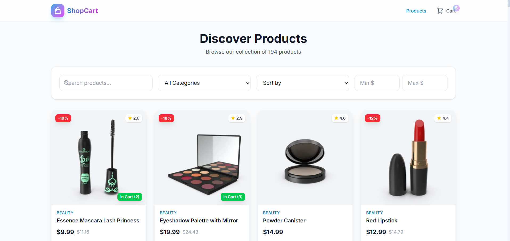
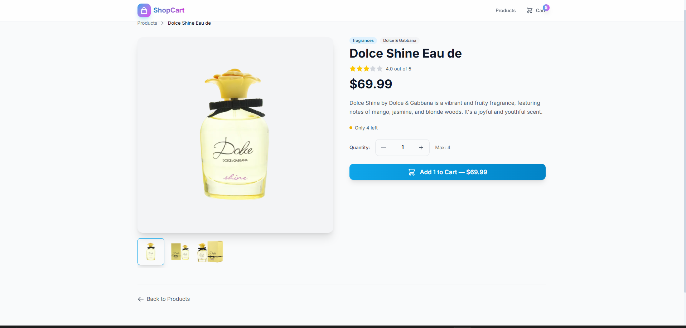
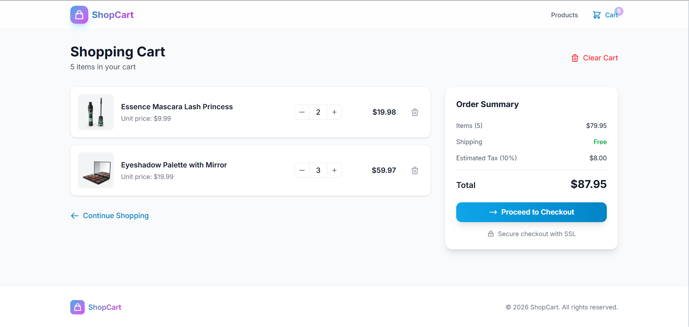
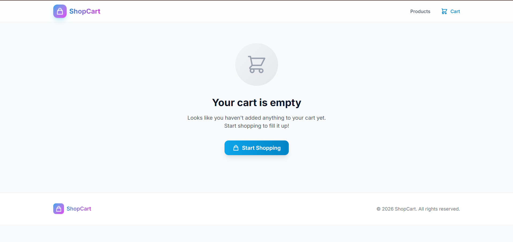

# E-Commerce Application

A modern, responsive e-commerce application built with React, Redux Toolkit, and Tailwind CSS.

## 🔗 Links

- **Live Demo (Local):** [http://localhost:5173](http://localhost:5173)
- **Live Demo (Netlify):** [https://ecom-task-285b1b.netlify.app/](https://ecom-task-285b1b.netlify.app/)
- **GitHub Repository:** [https://github.com/ManvarZeel/ecom_task.git](https://github.com/ManvarZeel/ecom_task.git)

## 🏗 Architecture Decisions

### Technology Stack
- **React 19**: Utilizing the latest features for building interactive UIs.
- **TypeScript**: Ensures type safety and better developer experience / maintainability.
- **Redux Toolkit**: Used for global state management, specifically for:
  - `cartSlice`: Managing cart items, quantities, and totals.
  - `productsSlice`: Handling product data fetching and caching.
- **Tailwind CSS**: Utility-first CSS framework for rapid, responsive implementation.
- **React Router 7**: Handling client-side navigation.
- **Vite**: Next-generation frontend tooling for fast builds and HMR.

### Design Patterns
- **Component-Based Architecture**: Components are organized by domain (`products`, `cart`, `common`) to ensure reusability and separation of concerns.
- **Custom Hooks**: Logic extracted into hooks like `useCart` to keep components clean and share functionality.
- **Slice Pattern**: Redux state is divided into slices (`cart`, `products`) to manage related state and reducers together.

## 📸 Screenshots

### 1. Home / Products Page
Displays a grid of products with filtering and sorting capabilities.


### 2. Product Detail Page
Shows detailed information about a selected product, including images, description, and "Add to Cart" functionality.


### 3. Cart Page
Lists selected items, allows quantity adjustment, and shows the order summary.


### 4. Empty Cart State
User-friendly empty state encouraging users to browse products.


## 🚀 Getting Started

1.  **Install dependencies:**
    ```bash
    npm install
    ```

2.  **Run development server:**
    ```bash
    npm run dev
    ```

3.  **Build for production:**
    ```bash
    npm run build
    ```
